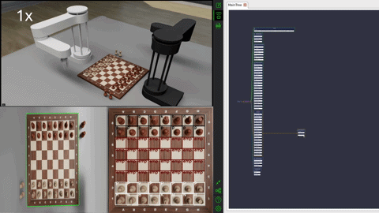

# ♟️ Bizon Chess Player

Bizon Chess Player is a ROS2-based autonomous dual-arm chess system running in simulation.  
Two robotic manipulators (`bizon2` and `bizon3`) play chess against each other in NVIDIA Isaac Sim — one controls the white pieces, the other controls the black pieces.

The project integrates perception, AI decision-making, motion planning, and behavior orchestration into a fully containerized robotics pipeline.



---

## 🏗 System Overview

- **Simulation**: NVIDIA Isaac Sim v5.1.0 renders the physics environment and camera stream.
- **Robot Control**: MoveIt2 performs motion planning for each robotic arm.
- **Perception**: Custom-trained Ultralytics YOLO26 model, converted layer-by-layer into a TensorRT engine and optimized for this system, detects chess pieces and reconstructs the board state.
- **Chess Engine**: Stockfish computes the optimal move for each side.
- **Decision & Execution**: Behavior Trees (BehaviorTree.CPP) orchestrate the full move execution pipeline (straight move, capture, promotion, en passant, promotion capture)
- **Containerization**: Entire stack runs inside Docker containers built on NVIDIA NGC images.

---

## Architecture

```
Isaac Sim (physics + camera) ──► YOLO perception ──►  Board State
                                                           │
                                                    Stockfish (AI move)
                                                           │
                                              Behavior Tree (orchestration)
                                                           │
                                                MoveIt2 (motion planning)
                                                           │
                                              Robot Arm (pick & place piece)
```

---

## ⚙️ Requirements

- Ubuntu 22.04
- NVIDIA Isaac Sim 5.1.0
- Docker & Docker Compose
- NVIDIA NGC login (for container access)

> It is recommended to clone the repository under:
> `/home/<username>/Documents/`

If another location is used, update the path inside `isaac_sim_start.sh`.

## Pre Install
- Install NVIDIA Isaac Sim 5.1.0 with ROS 2 container compatibility.
- Download the asset and model folders, then extract them into the project root directory
- Install Nvidia Docker Containers and login NGC
- Install docker-compose
- Download https://drive.google.com/file/d/1CkLfItfGiQZPKxY0u-t-2HWdBcdwbd3Y/view?usp=sharing and unzip. And move assets and models folder to project root directory.

---

## 🐳 Docker Initialization

Run the project inside the Docker container:

```bash
# Open a new docker terminal
sudo docker-compose -f docker/docker-compose-x86.yml run bizon_chess_player bash

# Install BehaviorTree.Cpp
cd ros_env/src
git clone https://github.com/BehaviorTree/BehaviorTree.CPP.git
cd <project_root>
colcon build

# Install Stockfish
cd <project_root>
git clone https://github.com/official-stockfish/Stockfish.git
cd Stockfish/src
make -j profile-build
```

## 🎮 Start Simulation

Open a new terminal:
```
./isaac_sim_standalone.sh
```

## 🤖 Multi-Robot Control

You must open three terminals per robot (six total for dual-arm operation).

Enter the container:
```
sudo docker container exec -it <container_id> bash
```
🔹 Robot: bizon2 (White)
```
ros2 launch bizon_player_bringup bizon_player_bringup.launch.py prefix:=bizon2
ros2 launch bizon_player_bringup bizon_lifecycle_dev.launch.py namespace:=bizon2
ros2 run bizon_behavior_clients bizon_behavior_tree_client_main --ros-args -r __ns:=/bizon2 -p use_sim_time:=true
```
🔹 Robot: bizon3 (Black)
```
ros2 launch bizon_player_bringup bizon_player_bringup.launch.py prefix:=bizon3
ros2 launch bizon_player_bringup bizon_lifecycle_dev.launch.py namespace:=bizon3
ros2 run bizon_behavior_clients bizon_behavior_tree_client_main --ros-args -r __ns:=/bizon3 -p use_sim_time:=true
```

# ⚠️ Notes
* This project is currently in alpha stage.

* Startup order is important.

* Namespaces are currently partially hardcoded (bizon2, bizon3).

* The system currently supports simultaneous control of two robots.

* Task-specific logic and robot-specific hardcoded parameters limit generalization to other robots or tasks.

* Full namespace abstraction and improved generalization are planned for future projects. 

# 📚 References

- [Ultralytics](https://github.com/ultralytics/ultralytics) – YOLO implementation framework  
- [BehaviorTree.CPP](https://github.com/BehaviorTree/BehaviorTree.CPP) – Behavior tree library for robotics  
- [Nav2](https://github.com/ros-navigation/navigation2) – ROS 2 Navigation framework  
- [Stockfish](https://github.com/official-stockfish/Stockfish) – Chess engine  
- [tensorrtx (YOLO26)](https://github.com/wang-xinyu/tensorrtx/tree/master/yolo26) – TensorRT implementation 